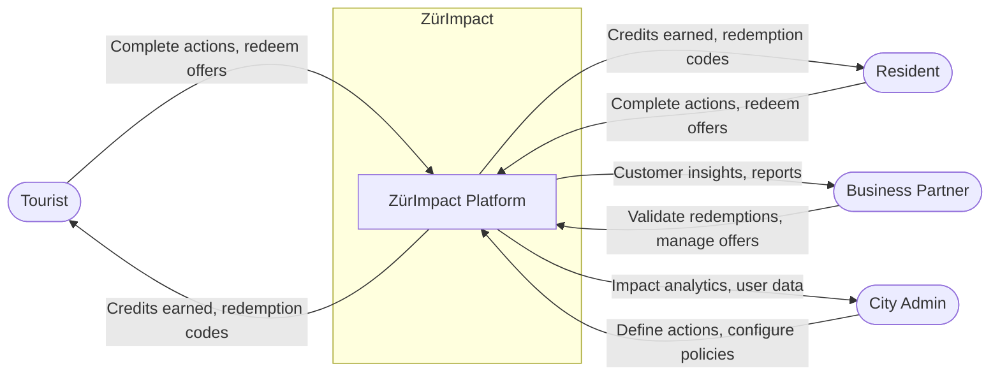
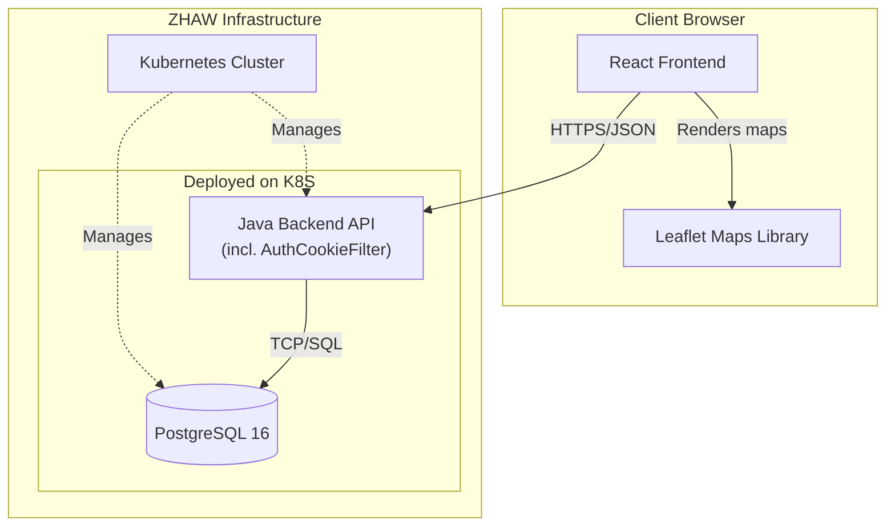
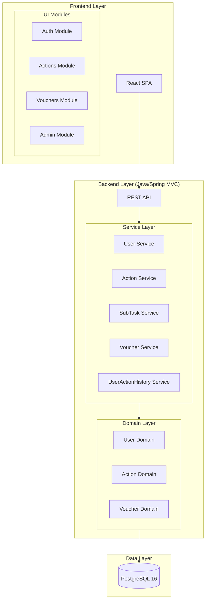

# Architecture

ZürImpact is a web-based platform that rewards sustainable actions in Zürich with credits redeemable at local partners. Users (tourists and residents) earn credits through eco-friendly behaviors and exchange them for experiences and services.

---

## System Context

### Business Context

### Technical Context

**Data formats:** JSON over HTTPS (client–server) · SQL (database) · environment variables (configuration)

---

## Top-Level Decomposition

### Module Responsibilities

| Module                        | Responsibility                            | Key Components                                        |
| ----------------------------- | ----------------------------------------- | ----------------------------------------------------- |
| **User Service**              | Authentication, profile management        | User entity, LoginController, AuthCookieFilter        |
| **Action Service**            | Action definition, filtering, completion  | Action entity, ActionController, GPS/QR validation    |
| **SubTask Service**           | Sub-task tracking within actions          | SubTask entity, SubTaskController, SubTaskValidator   |
| **Voucher Service**           | Voucher and partner offer management      | Voucher entity, VoucherController, VoucherCode entity |
| **UserActionHistory Service** | User progress and action history tracking | UserActionHistory entity, UserActionHistoryController |

---

## Architecture Decision Records

### ADR-001 — Monolithic Architecture

- **Decision:** Start with a modular monolith, not microservices
- **Rationale:** Simpler for a 9-person student team; faster development and debugging; single deployment reduces DevOps complexity; clear module boundaries allow future extraction
- **Consequences:** All services share the same deployment lifecycle; requires disciplined module boundaries; easier initial development, harder to scale horizontally

### ADR-002 — PostgreSQL as Primary Database

- **Decision:** Use PostgreSQL for all persistent data
- **Rationale:** Team familiarity; ACID guarantees critical for credit transactions; supports geospatial queries (PostGIS) for GPS features
- **Consequences:** Requires careful indexing strategy; single point of failure without replication (acceptable for MVP)

### ADR-003 — Separated Frontend Deployment

- **Decision:** React SPA hosted separately from the backend (static hosting)
- **Rationale:** Simplifies backend to a pure API; enables independent scaling of frontend and backend
- **Consequences:** Requires CORS configuration; two deployment pipelines; better separation of concerns

---

## Quality Goals

| Quality Goal        | Strategy                      | Implementation                                                                                     |
| ------------------- | ----------------------------- | -------------------------------------------------------------------------------------------------- |
| **Security**        | Defense in depth              | Cookie-based session auth, HTTPS only, input validation, SQL injection prevention, OWASP guidelines |
| **Performance**     | Caching and optimization      | DB query optimization, lazy loading in UI, CDN for assets                                          |
| **Usability**       | User-centered design          | Mobile-first responsive design, intuitive navigation                                               |
| **Reliability**     | Error handling and monitoring | Graceful degradation, health checks, structured logging                                            |
| **Maintainability** | Clean code practices          | Modular architecture, code reviews, automated testing, arc42 documentation                         |

---

## Constraints

| Constraint                | Description                                                   |
| ------------------------- | ------------------------------------------------------------- |
| **Web-Only Platform**     | No native apps; responsive web design, camera/GPS via browser |
| **Swiss Data Privacy**    | GDPR compliance, Swiss data residency preferred               |
| **Multi-Language**        | German and English minimum (i18next from day one)             |
| **Browser Compatibility** | Chrome, Safari, Firefox, Edge                                 |
| **ZHAW Infrastructure**   | Must deploy on ZHAW Kubernetes cluster via Rancher/ArgoCD     |
